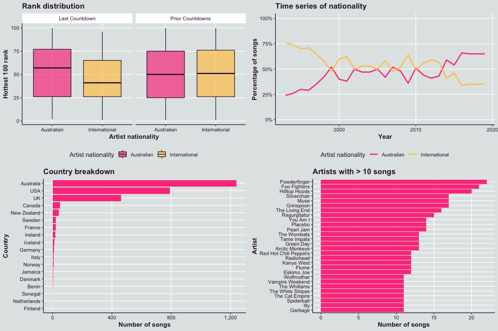

# hotteR 

Hottest 100 Countdown and Triple J Plays Webscraping and Analysis in R

## Installation

You can install the development version of `hotteR` from GitHub by
running the following:

``` r
devtools::install_github("hendersontrent/hotteR")
```

## Motivation

Previous analysis by [Orbisant
Analytics](https://www.orbisantanalytics.com/hottest-100) highlighted
interesting relationships in the 2019 Triple J Hottest 100 Countdown.
This was a fairly discrete piece of analysis, and given the amount of
manual work involved, motivated a more scalable and programmatic
approach to enable future analysis. An example of analysis that is
automated by the package includes the matrix of plots presented below.

<!-- -->

## Citation

You can cite `hotteR` using the following:

``` 

To cite package 'hotteR' in publications use:

  Trent Henderson and Joy Horng (2021). hotteR: Hottest 100 Countdown
  and Triple J Plays Webscraping and Analysis in R. R package version
  0.1.6.

A BibTeX entry for LaTeX users is

  @Manual{,
    title = {hotteR: Hottest 100 Countdown and Triple J Plays Webscraping and Analysis in R},
    author = {Trent Henderson and Joy Horng},
    year = {2021},
    note = {R package version 0.1.6},
  }
```
