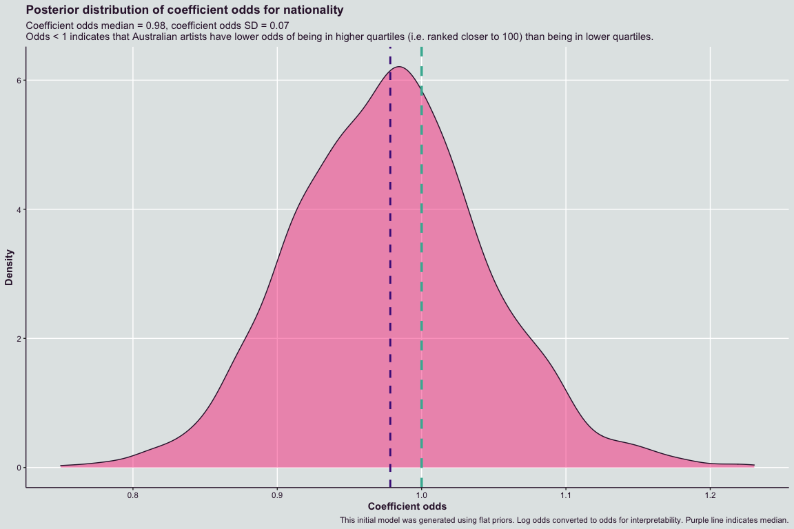
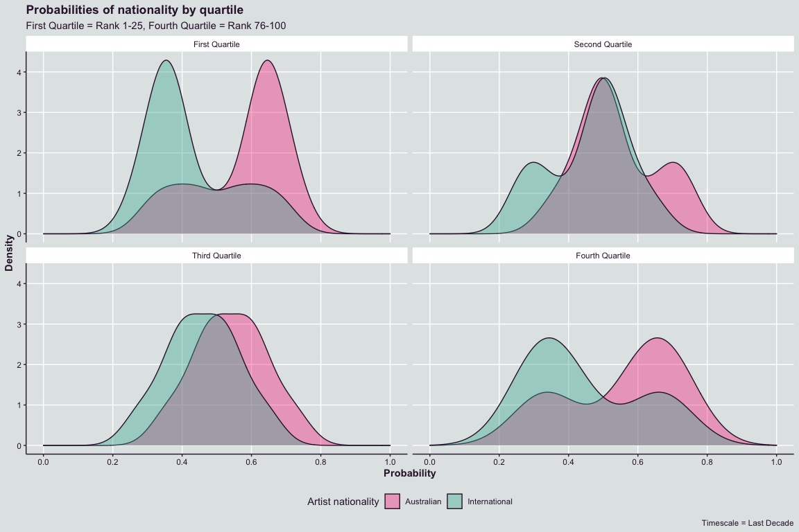
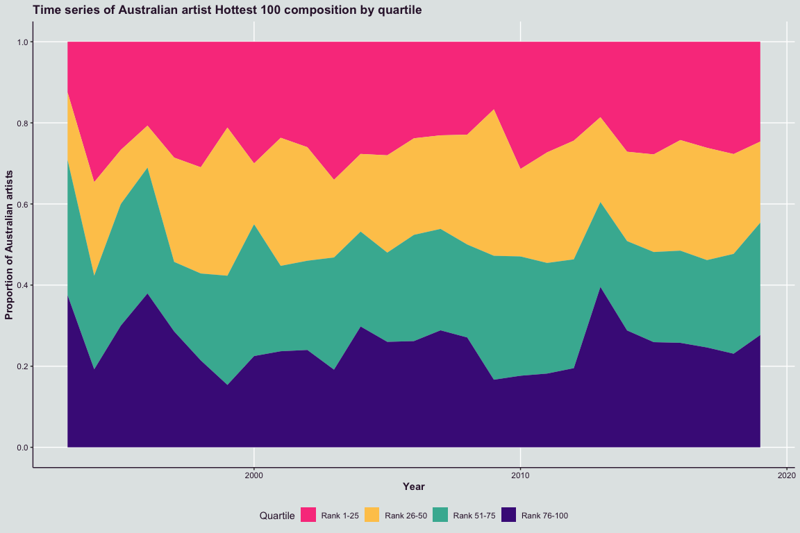

# hotteR 

Hottest 100 Countdown and Triple J Analysis in R.

## Installation

You can install `hotteR` from GitHub by running the following:

``` r
devtools::install_github("hendersontrent/hotteR")
```

## Motivation

Previous analysis by [Orbisant
Analytics](https://www.orbisantanalytics.com/hottest-100) highlighted
interesting relationships in the 2019 Triple J Hottest 100 Countdown.
This was a fairly discrete piece of analysis, and given the amount of
manual work involved, motivated a more scalable and programmatic
approach to enable future analysis.

## Core functions

### get\_countdowns()

You can webscrape all prior Hottest 100 Countdown results (including
Hottest 100 of the decade) using `get_countdowns()`.

``` r
library(hotteR)

countdown_data <- get_countdowns()
```

### historical\_countdowns

A full dataset of all previous Hottest 100 Countdowns available to-date
comes ready with the package. It has columns for rank, year, artist
name, song name, and artist nationality.

``` r
library(hotteR)

historical_countdowns
```

### do\_countdown\_analysis()

You can automatically get some high level analysis and data
visualisations for data retrieved from `get_countdowns()` or
`historical_countdowns` using `do_countdown_analysis()`.

``` r
library(dplyr)
library(magrittr)
library(janitor)
library(ggplot2)
library(ggpubr)
library(hotteR)

do_countdown_analysis(historical_countdowns)
```

<!-- -->

### get\_plays()

You can automatically pull summed counts of plays from the @triplejplays
Twitter account using the `get_plays()` one-line function. The data is
cleaned, processed, and summed behind the scenes, leaving you more time
to focus on analysis and data visualisation.

``` r
library(hotteR)

play_data <- get_plays(year = 2020)
```

### do\_plays\_analysis()

You can automatically get some high level analysis and data
visualisations for data retrieved from `get_plays()` using
`do_plays_analysis()`.

``` r
library(hotteR)

play_data <- get_plays(year = 2020)
do_plays_analysis(the_plays)
```

### calculate\_priors()

Bayesian functionality is built into the package given the annually
updating nature of the Hottest 100 Countdown. All Bayesian functions
have been coded in the probabilistic programming language `Stan` and
abstracted away into a one line R function for ease of use. The first
function is `calculate_priors()` which computes a mean, standard
deviation (SD), 2.5% credible interval lower bound and 97.5% credible
interval upper bound (together forming a 95% credible interval) for an
ordinal logistic regression model of quartile placement in the Hottest
100. The mean and SD calculated by this function can be used as
informative priors in a predictive model. This function takes one of two
timescales as an argument:

  - “Last Decade”
  - “All Time”

<!-- end list -->

``` r
library(tidyverse)
library(rstan)
library(hotteR)

priors <- calculate_priors(timescale = "All Time")
```

### plot\_priors()

As well as the formal value calculation of priors, a calculation and
distribution visualisation function is also included as `plot_priors()`.
This function produces a density plot of the coefficient for the
nationality predictor variable. This function takes one of two
timescales as an argument:

  - “Last Decade”
  - “All Time”

<!-- end list -->

``` r
library(tidyverse)
library(rstan)
library(hotteR)

plot_prior(timescale = "All Time")
```

<!-- -->

### plot\_probabilities()

You can automatically produce density plots of probability of
belongingness by Hottest 100 Countdown quartile and nationality with
`plot_probabilities()`. This function takes one of two timescales as an
argument:

  - “Last Decade”
  - “All Time”

<!-- end list -->

``` r
library(tidyverse)
library(hotteR)

plot_probabilities(timescale = "Last Decade")
```

<!-- -->

### plot\_quartile\_area()

You can automatically produce density plots by quartile and nationality
using `plot_quartile_area()`:

``` r
library(tidyverse)
library(hotteR)

plot_quartile_area()
```

<!-- -->

### theme\_hotteR()

As well as data scraping and analysis functions, `hotteR` also provides
a distinct and striking contrasting colour palette that is called and
used by default when the package is loaded.

``` r
library(scales)

scales::show_col(hotteR:::hotteR_palette)
```

<!-- -->

## Further work

More functions are currently under development. Please check back soon\!
