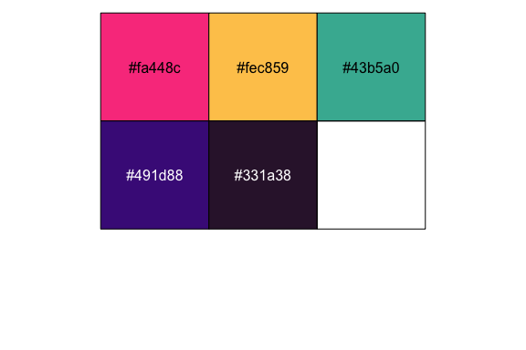

# hotteR 

Hottest 100 Countdown and Triple J Analysis in R.

## Installation

You can install `hotteR` from GitHub by running the following:

``` r
devtools::install_github("hendersontrent/hotteR")
```

## Motivation

Previous analysis by [Orbisant
Analytics](https://www.orbisantanalytics.com/hottest-100) highlighted
interesting relationships in the 2019 Triple J Hottest 100 Countdown.
This was a fairly discrete piece of analysis, and given the amount of
manual work involved, motivated a more scalable and programmatic
approach to enable future analysis.

## Core functions

### get\_plays()

You can automatically pull summed counts of plays from the @triplejplays
Twitter account using the `get_plays()` one-line function. The data is
cleaned, processed, and summed behind the scenes, leaving you more time
to focus on analysis and data visualisation.

``` r
library(hotteR)
play_data <- get_plays(year = 2020)
```

### do\_plays\_analysis()

You can automatically get some high level analysis and data
visualisations for data retrieved from `get_plays()` using
`do_plays_analysis`.

``` r
library(hotteR)
play_data <- get_plays(year = 2020)
do_plays_analysis(the_plays)
```

### theme\_hotteR

As well as data scraping and analysis functions, `hotteR` also provides
a distinct and striking contrasting colour palette that is called and
used by default when the package is loaded.

``` r
library(scales)
scales::show_col(hotteR:::hotteR_palette)
```

<!-- -->

## Further work

More functions are currently under development - with a few specifically
related to the Hottest 100 Countdown. Please check back soon\!
